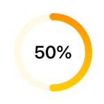
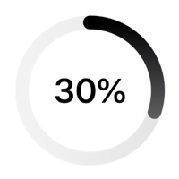
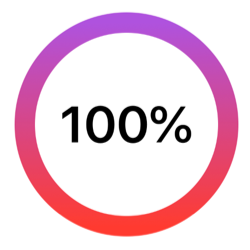

# RossViewKit

This is a collection of reusable swift views to speed up development of apps.

There is an example app in the project. You can take a look at that if you are interested in how to use it.

## RoundProgressBar

| Attribute | Type     | Default           | Description                             |
| --------- | -------- | ----------------- | --------------------------------------- |
| progress  | `Double`, `Binding<Double>`  | `0.0`             | The progress, use a binding progress to make the progress bar update when the progress does |
| max       | `Double` | `1.0`             | The maximum progress to reach 100%      |
| color1    | `Color`  | `Color.primary`   | The first color that will be on top     |
| color2    | `Color`  | `Color.secondary` | The second color that will be at bottom |

### Examples

A round progressbar with 50% progress

```swift
@State var progress: Double = 0.5
RoundProgressBar(progress: $progress, color1: .orange, color2: .yellow)
    .frame(width: 100, height: 100)
```



You can also change the max progress. Below the progress is 76 but the max is 250 so it's still just 30% progress.

```swift
@State var progress: Double = 76

RoundProgressBar(progress: $progress, max: 250)
    .frame(width: 150, height: 150)
```



And as you can see all examples are using different frame size. The inner text and the round bar will resize depending on its frame.
You can also use a double directly to set a static progress.

```swift
RoundProgressBar(progress: 1.00, color1: .purple, color2: .red)
    .frame(width: 200, height: 200)
```


